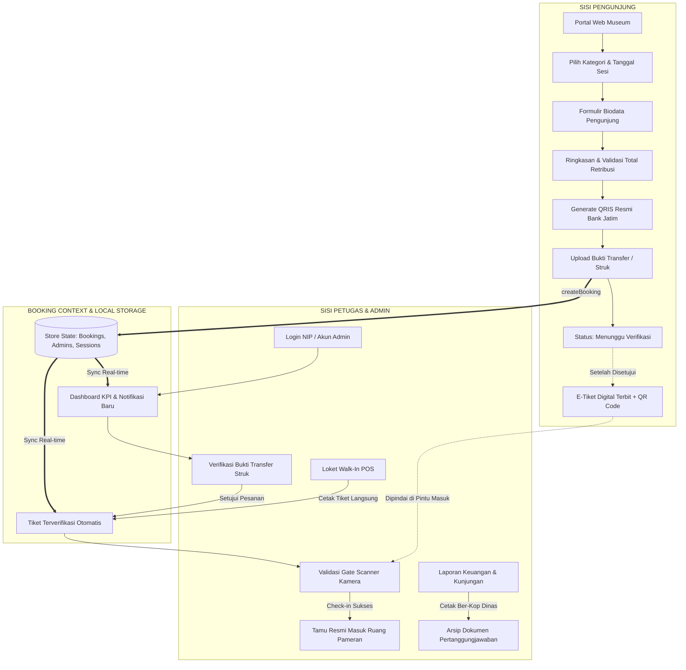

# LAPORAN KOMPREHENSIF PROYEK MAGANG
## RANCANG BANGUN & MODERNISASI SISTEM E-TICKETING DAN INFORMASI WISATA TERPADU BERBASIS WEB RESPONSIVE
### UPTD MUSEUM BLAMBANGAN — DINAS KEBUDAYAAN DAN PARIWISATA KABUPATEN BANYUWANGI

---

```
IDENTITAS DOKUMEN LAPORAN:
Judul Proyek     : Modernisasi Web Portal, E-Ticketing, dan Gate Validation System Museum Blambangan
Objek / Instansi : UPTD Museum Blambangan Banyuwangi (Disbudpar Kab. Banyuwangi)
Alamat Lokasi    : Jl. Jenderal Ahmad Yani No. 78, Kec. Banyuwangi, Jawa Timur 68416
Teknologi Utama  : React 19, TypeScript, Vite, Tailwind CSS, jsPDF, html2canvas, jsQR, qrcode.react
Status Build     : Production Ready (Vite v8.3.2, 0 Errors, Chunks Optimized)
Tanggal Rilis    : Oktober 2026
```

---

## DAFTAR ISI

1. **BAB I: PENDAHULUAN**
   - 1.1. Latar Belakang & Urgensi Modernisasi
   - 1.2. Permasalahan Sistem Eksisting (`https://museum.banyuwangikab.go.id/`)
   - 1.3. Tujuan & Sasaran Proyek
   - 1.4. Manfaat Proyek (Akademis, Kedinasan, dan Masyarakat)
   - 1.5. Ruang Lingkup Sistem

2. **BAB II: KAJIAN TEKNIS & PERATURAN TERKAIT**
   - 2.1. Landasan Hukum Tarif Retribusi Daerah (Perda Kab. Banyuwangi)
   - 2.2. Standar Pembayaran Nontunai Nasional (QRIS Bank Indonesia & ASPI)
   - 2.3. Rekening Kas Daerah & Bank Jatim Cabang Banyuwangi
   - 2.4. Jam Kerja Kedinasan & Sistem Kuota Pengunjung

3. **BAB III: ARSITEKTUR SISTEM & SPESIFIKASI TEKNOLOGI**
   - 3.1. Tech Stack & Dependensi Inti
   - 3.2. Arsitektur Komponen & Aliran Data (*Data Flow Architecture*)
   - 3.3. Struktur Direktori Proyek
   - 3.4. Mekanisme State Management & Penyimpanan Data

4. **BAB IV: IMPLEMENTASI FITUR SISI PENGUNJUNG (VISITOR FLOW)**
   - 4.1. Web Portal Utama & Galeri Sejarah Interaktif
   - 4.2. Penjadwalan Cerdas & Proteksi Akhir Pekan
   - 4.3. Formulir Reservasi 8 Langkah Validasi
   - 4.4. Ringkasan Pesanan & Kalkulator Retribusi Akurat
   - 4.5. Gateway Pembayaran QRIS Dinamis Resmi Bank Jatim
   - 4.6. Pelacakan Status Verifikasi & Notifikasi
   - 4.7. E-Tiket Digital Pass (PDF Vektor, Simpan Gambar, dan WhatsApp)
   - 4.8. Fitur "Tiket Saya" & Privasi Data Pengunjung
   - 4.9. Pengalaman Akses Mobile (Mobile Simulator & Floating Action)

5. **BAB V: IMPLEMENTASI FITUR SISI PETUGAS / ADMIN (ADMIN FLOW)**
   - 5.1. Sistem Keamanan & Autentikasi Multi-Role
   - 5.2. Dashboard Eksekutif & Monitoring Real-time
   - 5.3. Manajemen & Verifikasi Pesanan Kunjungan
   - 5.4. Validasi Masuk (Kamera Pindai QR Gate & Anti-Double Check-In)
   - 5.5. Loket Pembelian Langsung di Tempat (Walk-In POS)
   - 5.6. Basis Data & Demografi Pengunjung
   - 5.7. Laporan Pertanggungjawaban Retribusi & Format Cetak Kedinasan
   - 5.8. Konfigurasi Sistem, Kuota Sesi, & Akun Petugas

6. **BAB VI: INTEGRASI IDENTITAS BUDAYA LOKAL BANYUWANGI**
   - 6.1. Filosofi Motif Batik Gajah Oling (*Eling marang Gusti*)
   - 6.2. Ikonografi Omprok Penari Gandrung & Seblang
   - 6.3. Peninggalan Sejarah Candi Macan Putih & Kerajaan Blambangan
   - 6.4. Harmonisasi Warna Resmi *Royal Banyuwangi Navy & Blambangan Gold*

7. **BAB VII: OPTIMALISASI PERFORMA & KEAMANAN SISTEM**
   - 7.1. Kompresi Gambar Aset (Penghematan Ukuran 82%)
   - 7.2. Pemuatan Dinamis (*Lazy Loading & Code Splitting*)
   - 7.3. Proteksi Akses Route Guard
   - 7.4. Mekanisme Pencegahan Tiket Ganda (*Anti-Double Scan*)

8. **BAB VIII: HASIL PENGUJIAN & VERIFIKASI AKHIR**
   - 8.1. Hasil Kompilasi & Build Production
   - 8.2. Pengujian Fungsionalitas End-to-End
   - 8.3. Pengujian Responsivitas Lintas Perangkat

9. **BAB IX: PANDUAN DEPLOYMENT & RENCANA PENGEMBANGAN**
   - 9.1. Persyaratan Lingkungan Server (Wajib HTTPS untuk Kamera Scanner)
   - 9.2. Opsi Penerapan Hosting (Vercel / cPanel Diskominfo Banyuwangi)
   - 9.3. Integrasi Cloud Database (Supabase PostgreSQL / MySQL Pemkab)

10. **BAB X: PENUTUP & KESIMPULAN**

---

## BAB I: PENDAHULUAN

### 1.1. Latar Belakang & Urgensi Modernisasi
Museum Blambangan yang berlokasi di pusat Kabupaten Banyuwangi merupakan salah satu museum daerah terpenting di Jawa Timur, menyimpan ribuan benda cagar budaya peninggalan era prasejarah, Kerajaan Blambangan, Majapahit, hingga masa kolonial Belanda. Sebagai salah satu destinasi wisata edukasi unggulan dalam strategi *"The Sunrise of Java"* dan program *"Banyuwangi Rebound"*, jumlah kunjungan wisatawan domestik, pelajar, maupun mancanegara terus mengalami peningkatan.

Namun, sistem pelayanan publik dan penjualan tiket yang berjalan selama ini masih didominasi oleh pencatatan tiket manual di loket fisik, yang rentan terhadap antrean panjang, ketidaksesuaian rekapitulasi retribusi kas daerah, serta ketidaktersediaan reservasi jadwal online bagi rombongan studi tour.

### 1.2. Permasalahan Sistem Eksisting
Berdasarkan evaluasi terhadap situs web publik lama Museum Blambangan (`https://museum.banyuwangikab.go.id/`), ditemukan beberapa kelemahan mendasar:
1. **Sifat Web Hanya Statis / Satu Arah**: Website lama hanya memuat informasi teks sejarah tanpa adanya modul interaktif untuk pemesanan tiket online.
2. **Tidak Adanya Sistem Pembayaran Nontunai Digital**: Belum terintegrasi dengan kanal QRIS resmi perbankan daerah (Bank Jatim), padahal Pemkab Banyuwangi aktif menggalakkan gerakan *Cashless Society*.
3. **Pencatatan Retribusi Masih Manual**: Petugas loket harus merekap buku register tamu secara manual, menyulitkan penyusunan laporan keuangan harian/bulanan untuk Disbudpar Banyuwangi.
4. **Resiko Penumpukan Wisatawan**: Tidak adanya pengaturan kuota per sesi kunjungan, sehingga berisiko menimbulkan kerumunan melebihi kapasitas ruang galeri cagar budaya.

### 1.3. Tujuan & Sasaran Proyek
Tujuan utama dari proyek magang ini adalah:
1. Membangun platform web terpadu yang memadukan **Portal Informasi Wisata Budaya** dengan **Sistem E-Ticketing Modern**.
2. Mengintegrasikan pembayaran digital QRIS standar Bank Indonesia & ASPI yang langsung terhubung dengan rekening Pendapatan Asli Daerah (PAD) Kabupaten Banyuwangi di Bank Jatim.
3. Menyediakan sistem validasi gerbang masuk (*Gate Scanner*) berbasis QR Code pada perangkat tablet/smartphone petugas untuk verifikasi cepat dan mencegah penggunaan tiket ganda.
4. Menyediakan dashboard administratif komprehensif bagi petugas loket, verifikator, dan bendahara penerimaan dinas.

### 1.4. Manfaat Proyek
- **Bagi Pengunjung**: Kepastian reservasi jadwal, kemudahan pembayaran via m-Banking/e-wallet, serta penerbitan e-tiket instan yang praktis disimpan di HP tanpa resiko sobek/hilang.
- **Bagi Petugas & Pengelola Museum**: Efisiensi proses verifikasi, otomatisasi pembukuan retribusi daerah, pengendalian kapasitas ruangan, dan penghapusan pencatatan tiket kertas manual.
- **Bagi Pemerintah Daerah (Dinas Kebudayaan & Pariwisata)**: Transparansi data retribusi PAD secara real-time dan tersedianya dokumen pelaporan resmi kedinasan siap cetak.

### 1.5. Ruang Lingkup Sistem
Sistem dirancang sebagai **Single Page Application (SPA) Full Responsive**, mencakup dua antarmuka utama:
1. **Front-End Pengunjung**: Portal web profil museum, galeri foto, jadwal operasional, alur booking 8 tahap, pembayaran QRIS, dan e-tiket boarding pass.
2. **Back-End Petugas / Admin**: Sistem login multi-role, dashboard KPI, verifikasi struk transfer, loket kasir walk-in, gate scanner barcode, data master pengunjung, laporan keuangan retribusi, dan pengaturan sesi/kuota.

---

## BAB II: KAJIAN TEKNIS & PERATURAN TERKAIT

### 2.1. Landasan Hukum Tarif Retribusi Daerah
Penetapan tarif retribusi tanda masuk Museum Blambangan diatur secara ketat berdasarkan Peraturan Daerah (Perda) Kabupaten Banyuwangi tentang Retribusi Jasa Usaha / Tempat Rekreasi dan Olahraga. Rincian tarif resmi yang diimplementasikan dalam sistem:

| No | Kategori Pengunjung | Tarif Retribusi (Per Orang) | Keterangan & Kriteria |
| :-: | :--- | :---: | :--- |
| 1 | **Pelajar / Mahasiswa** | **Rp 5.000** | Wajib menunjukkan Kartu Pelajar / Kartu Tanda Mahasiswa (KTM) aktif. |
| 2 | **Pengunjung Umum** | **Rp 7.500** | Wisatawan domestik, keluarga, dan pengunjung perorangan. |
| 3 | **Wisatawan Mancanegara** | **Rp 20.000** | Turis asing / international travelers. |
| 4 | **Pelajar Rombongan** | **Rp 5.000** | Kunjungan studi tour sekolah/universitas dengan minimal 10 orang peserta. |

### 2.2. Standar Pembayaran Nontunai Nasional (QRIS)
Sistem menggunakan spesifikasi **QRIS Nasional Standar ASPI / Bank Indonesia** berjenis dinamis dengan merchant resmi Bank Jatim:
- **Merchant Name**: `MUSEUM BLAMBANGAN`
- **Merchant City**: `BANYUWANGI`
- **Postal Code**: `68414`
- **National Merchant ID (NMID)**: `ID2024326864723`
- **Terminal ID**: `A01`
- **Interoperabilitas**: Dapat dipindai dan dibayar secara universal oleh seluruh aplikasi mobile banking nasional (Bank Jatim, BCA, Mandiri Livin', BRImo, BNI, BSI) maupun dompet digital resmi (GoPay, OVO, DANA, ShopeePay, LinkAja).

### 2.3. Rekening Kas Daerah Pemkab Banyuwangi
Untuk pengunjung yang memilih metode transfer bank konvensional, sistem menyajikan rekening resmi penerimaan retribusi daerah:
- **Bank Penerima**: PT BPD Jawa Timur Tbk (Bank Jatim Cabang Banyuwangi)
- **Nomor Rekening**: `0021005380`
- **Atas Nama Rekening**: `DISBUDPAR KAB BANYUWANGI`

### 2.4. Jam Kerja Kedinasan & Kuota Kunjungan
Sesuai dengan ketentuan operasional kantor kedinasan Pemerintah Kabupaten Banyuwangi:
- **Hari Buka**: Senin s.d. Jumat (Hari Sabtu, Minggu, dan Libur Nasional TUTUP dinas).
- **Pembagian Sesi**:
  1. *Sesi 1 (Pagi)*: 07:30 – 10:00 WIB (Kapasitas maksimal: 100 orang)
  2. *Sesi 2 (Siang)*: 10:00 – 12:30 WIB (Kapasitas maksimal: 100 orang)
  3. *Jam Istirahat / ISHOMA*: 12:30 – 13:30 WIB (Loket ditutup sementara untuk ibadah dan istirahat petugas)
  4. *Sesi 3 (Sore)*: 13:30 – 16:00 WIB (Kapasitas maksimal: 100 orang)

---

## BAB III: ARSITEKTUR SISTEM & SPESIFIKASI TEKNOLOGI

### 3.1. Tech Stack & Dependensi Inti
Sistem dibangun di atas fondasi teknologi modern berbasis JavaScript/TypeScript:
- **Framework Utama**: `React 19 (v19.2.8)` dengan `React-DOM`
- **Bahasa Pemrograman**: `TypeScript (v6.0.2)` untuk keamanan tipe data (*type safety*)
- **Build Tool & Bundler**: `Vite (v8.3.0)` dengan kecepatan *Hot Module Replacement* (HMR) tinggi
- **CSS Framework**: `Tailwind CSS (v3.4.17)` dengan arsitektur utilitas kustom
- **Ikonografi**: `Lucide React (v1.51.0)`
- **Generator Dokumen PDF**: `jsPDF (v4.2.1)` dan `html2canvas (v1.4.1)` (di-load secara dinamis)
- **Barcode & QR Engine**: `qrcode.react (v4.2.0)` untuk render SVG QR, dan `jsQR (v1.4.0)` untuk pembacaan QR kamera
- **Micro-Interactions**: `canvas-confetti (v1.9.4)` untuk feedback visual verifikasi

### 3.2. Arsitektur Aliran Data (Data Flow Architecture)



### 3.3. Struktur Direktori Proyek

```
PROJECT MAGANG/
├── public/
│   └── assets/                     # Berkas gambar artefak HD terkompresi, motif batik, logo resmi
├── src/
│   ├── assets/                     # Aset bawaan template
│   ├── components/
│   │   ├── admin/                  # 11 Modul Layar Petugas / Admin
│   │   │   ├── AdminDashboard.tsx
│   │   │   ├── AdminDataPengunjung.tsx
│   │   │   ├── AdminDetailPesanan.tsx
│   │   │   ├── AdminLaporan.tsx
│   │   │   ├── AdminLayout.tsx
│   │   │   ├── AdminLogin.tsx
│   │   │   ├── AdminNotifikasiRiwayat.tsx
│   │   │   ├── AdminPengaturan.tsx
│   │   │   ├── AdminPesananKunjungan.tsx
│   │   │   ├── AdminScanValidasi.tsx
│   │   │   ├── AdminTiketKunjungan.tsx
│   │   │   └── AdminWalkInModal.tsx
│   │   ├── common/                 # Komponen Berbagi (Reusable UI & Heritage)
│   │   │   ├── GajahOlingMotif.tsx
│   │   │   ├── ModernTicketPass.tsx
│   │   │   ├── MuseumFeatureModals.tsx
│   │   │   ├── MuseumLogo.tsx
│   │   │   └── QRISLogo.tsx
│   │   └── user/                   # 10 Modul Layar Pengunjung
│   │       ├── Screen1Landing.tsx
│   │       ├── Screen2FormData.tsx
│   │       ├── Screen3Ringkasan.tsx
│   │       ├── Screen4PembayaranQRIS.tsx
│   │       ├── Screen6BookingBerhasil.tsx
│   │       ├── Screen7StatusVerifikasi.tsx
│   │       ├── Screen8TiketKunjungan.tsx
│   │       ├── Screen9MobileSimulator.tsx
│   │       └── UserWebPortal.tsx
│   ├── context/
│   │   └── BookingContext.tsx      # State management sentral aplikasi
│   ├── data/
│   │   └── mockData.ts             # Data inisial pesanan, log aktivitas, akun dinas
│   ├── types/
│   │   └── index.ts                # TypeScript interface & type definitions
│   ├── utils/
│   │   ├── qrisDownloadUtils.ts    # Helper generator canvas & download QRIS
│   │   └── sessionUtils.ts         # Helper kalkulasi sesi, kuota, dan hari kerja
│   ├── App.tsx                     # Router utama, route guards, & lazy load chunks
│   ├── main.tsx                    # Entry point React 19
│   └── index.css                   # Tailwind styles, font families, dan custom scrollbar
├── package.json                    # Konfigurasi dependensi
├── tsconfig.json                   # Konfigurasi compiler TypeScript
└── vite.config.ts                  # Konfigurasi build Vite & manualChunks
```

---

## BAB IV: IMPLEMENTASI FITUR SISI PENGUNJUNG (VISITOR FLOW)

### 4.1. Web Portal Utama & Galeri Sejarah Interaktif (`UserWebPortal.tsx`)
Portal utama dirancang sebagai pintu gerbang digital wisatawan. Dilengkapi:
- **Hero Slider Sinematik**: Menampilkan 4 foto artefak dan gedung museum resolusi tinggi dengan rotasi otomatis setiap 6 detik.
- **Papan Informasi Sesi Real-time**: Menampilkan ketersediaan kuota 100 orang per sesi untuk hari ini.
- **Modul Edukasi Koleksi Unggulan**: Dokumentasi artefak Arkeologi Candi Macan Putih, Arca Lingga Yoni, Etnografi suku Using, dan koleksi numismatika kuno.
- **Integrasi Peta & Kontak Resmi**: Tautan navigasi Google Maps, penyalinan alamat resmi dengan 1-klik, dan nomor layanan dinas.

### 4.2. Penjadwalan Cerdas & Proteksi Akhir Pekan
Sistem mengimplementasikan utilitas cerdas `isWeekendClosed`:
- Kalender secara otomatis mendeteksi hari Sabtu dan Minggu sebagai hari libur kedinasan dan menonaktifkan pemilihan tanggal tersebut.
- Disediakan tombol jalan pintas (*Quick Date Selector*) yang secara cerdas hanya menampilkan hari kerja aktif terdekat (Senin s.d. Jumat).

### 4.3. Formulir Reservasi 8 Langkah Validasi (`Screen2FormData.tsx`)
Formulir dirancang terstruktur dengan indikator keterisian dinamis (*Progress Docked Bar*):
1. **Nama Lengkap**: Validasi minimal 3 karakter huruf.
2. **Jumlah Wisatawan**: Pengaturan jumlah tiket dengan batas minimal 1 orang.
3. **Nomor WhatsApp**: Validasi nomor telepon minimal 8 digit angka.
4. **Alamat Email**: Validasi format email standar (`@` dan domain valid).
5. **Alamat Domisili**: Asal kota / kabupaten pengunjung.
6. **Kategori Kunjungan**: Pemilihan salah satu dari 4 kategori resmi Perda.
7. **Tanggal Kunjungan**: Pemilihan tanggal hari kerja dengan filter kapasitas kuota.
8. **Sesi Kunjungan**: Pemilihan sesi waktu (Pagi, Siang, atau Sore).

### 4.4. Ringkasan Pesanan & Kalkulator Retribusi Akurat (`Screen3Ringkasan.tsx`)
Sebelum masuk tahap pembayaran, pengunjung disajikan rincian biaya:
- Perhitungan: `Total Tagihan = Tarif Kategori × Jumlah Wisatawan`.
- Ditampilkan kartu rincian elegan dengan latar warna *cream* keemasan khas Blambangan (`#FCF8EF`) lengkap dengan jam sesi dan nomor registrasi sementara.

### 4.5. Gateway Pembayaran QRIS Dinamis Resmi Bank Jatim (`Screen4PembayaranQRIS.tsx`)
Fitur pembayaran dirancang setara aplikasi perbankan modern:
- **QRIS Matrix Terpadu**: Di-render secara tajam menggunakan `QRCodeCanvas`.
- **9 Micro-Logo Vektor Resmi**: Tampilan micro-logo Bank Jatim, BCA, Livin' Mandiri, BRImo, BNI, GoPay, OVO, DANA, dan ShopeePay.
- **Fasilitas Unduh QRIS**: Tombol untuk mengunduh gambar kartu QRIS berbingkai resmi ke galeri HP agar dapat dibuka lewat aplikasi m-Banking mana pun.
- **Tombol Salin No. Rekening**: Menyalin nomor rekening kas daerah Bank Jatim `0021005380`.
- **Upload Bukti Transfer**: Mendukung upload berkas foto (JPG, PNG, WebP) dengan tombol demo instan untuk kemudahan pengujian.

### 4.6. Pelacakan Status Verifikasi (`Screen7StatusVerifikasi.tsx`)
Pengunjung dapat memantau status pesanan mereka secara visual:
- **Stepper Vertikal 3 Tahap**:
  1. *Pembayaran Berhasil*: Struk transfer tersimpan di sistem.
  2. *Bukti Pembayaran Terkirim*: Masuk antrean verifikasi loket.
  3. *Verifikasi Petugas*: Menunggu persetujuan admin / Terbit tiket resmi.
- Menampilkan filosofi luhur Batik Gajah Oling (*Eling marang Gusti*) sebagai wujud komitmen ketelitian dan integritas petugas loket.

### 4.7. E-Tiket Digital Pass (`ModernTicketPass.tsx`)
Setelah pembayaran diverifikasi oleh petugas loket, e-tiket resmi otomatis terbit dengan format *Boarding Pass*:
- **Kode QR Khusus Gate**: Memuat payload verifikasi unik `VERIFIED_TICKET:<ID_BOOKING>:<KATEGORI>:<NAMA>`.
- **Barcode Serial Standar**: Barcode garis visual penanda tiket asli.
- **Watermark Keamanan Gajah Oling**: Pola batik emas tipis untuk mencegah pemalsuan tiket.
- **Multi-Opsi Penyimpanan**:
  1. *Unduh PDF Resmi*: Menghasilkan dokumen tiket PDF tajam beresolusi 300 DPI dengan kop resmi Pemkab Banyuwangi.
  2. *Simpan Gambar ke Galeri HP*: Menyimpan tiket dalam format gambar PNG untuk akses cepat offline.
  3. *Kirim ke WhatsApp*: Mengirim ringkasan tiket dan link akses langsung ke nomor WhatsApp pemesan.
  4. *Cetak Tiket Fisik*: Format cetak bersih ramah kertas.

### 4.8. Fitur "Tiket Saya" & Privasi Data Pengunjung
Untuk menjaga privasi wisatawan di ruang publik, portal web menerapkan penyaringan `myBookings`:
- Perangkat pengunjung hanya menyimpan daftar ID tiket miliknya sendiri (`mb_my_booking_ids`).
- Pengunjung **tidak dapat melihat tiket milik orang lain**, namun dapat menambahkan tiket keluarga melalui fitur **Klaim Tiket** dengan memasukkan nomor booking.

### 4.9. Pengalaman Akses Mobile & Floating Action
Dioptimalkan secara khusus untuk smartphone:
- Disediakan **Floating Quick-Booking Button** di sudut bawah layar yang otomatis muncul saat pengunjung membaca artikel koleksi ke bawah.
- Terdapat **Screen 9 Mobile Simulator** di dalam web untuk menguji pratinjau tampilan di berbagai resolusi layar HP secara real-time.

---

## BAB V: IMPLEMENTASI FITUR SISI PETUGAS / ADMIN (ADMIN FLOW)

### 5.1. Sistem Keamanan & Autentikasi Multi-Role (`AdminLogin.tsx`)
- **Proteksi Akses (Route Guard)**: Setiap permintaan rute URL `#admin/*` secara ketat dialihkan ke layar login jika token autentikasi tidak valid.
- **Multi-Role User**:
  1. *Superadmin*: Hak penuh sistem, manajemen akun admin, reset data.
  2. *Verifikator*: Memeriksa dan memvalidasi keabsahan struk transfer QRIS.
  3. *Petugas Loket*: Melayani pembelian langsung (*walk-in POS*) dan pemindaian gate.
  4. *Keuangan*: Rekapitulasi retribusi kas daerah dan pelaporan pendapatan dinas.

### 5.2. Dashboard Eksekutif & Monitoring Real-time (`AdminDashboard.tsx`)
Menampilkan ringkasan visual performa harian:
- **4 Kartu Metrik Utama**: Total Wisatawan, Pendapatan Retribusi (Rp), Pesanan Pending Menunggu Verifikasi, dan Keterisian Kuota Sesi Hari Ini.
- **Grafik Tren Kunjungan Mingguan**: Visualisasi perbandingan kunjungan kategori Pelajar, Umum, dan Mancanegara.
- **Tabel Kedatangan Hari Ini**: Daftar tamu terjadwal dengan tombol check-in instan.

### 5.3. Manajemen & Verifikasi Pesanan Kunjungan (`AdminPesananKunjungan.tsx` & `AdminDetailPesanan.tsx`)
- **Pencarian & Filter Multi-Kriteria**: Pencarian nama pengunjung, nomor booking, kategori, metode pembayaran, sesi waktu, dan tanggal.
- **Pemeriksaan Bukti Transfer (Modal Preview)**: Petugas dapat memperbesar foto struk transfer untuk mencocokkan nominal transaksi dengan mutasi rekening Bank Jatim.
- **Aksi Persetujuan & Penolakan**:
  - *Setujui*: Menerbitkan e-tiket secara langsung disertai animasi konfeti.
  - *Tolak*: Petugas wajib memasukkan alasan penolakan (misal: "Nominal struk tidak sesuai" atau "Foto buram") yang tercatat transparan di riwayat sistem.

### 5.4. Validasi Gate Scanner Kamera (`AdminScanValidasi.tsx`)
Dirancang untuk operasional di pintu masuk museum:
- **Live Camera Scanner**: Menggunakan pustaka `jsQR` untuk mendeteksi kode QR dari layar HP pengunjung dalam hitungan milidetik.
- **Audio Chime Synthesizer**: Menghasilkan sinyal audio nada tinggi (hijau) untuk tiket sah, dan nada rendah (merah) untuk tiket bermasalah.
- **Sistem Anti-Double Check-In**: Jika tiket yang sama dipindai untuk kedua kalinya, sistem langsung memunculkan peringatan merah: *"PERINGATAN: Tiket sudah pernah masuk pada jam [Waktu]!"*.
- **Pencarian Tamu Manual**: Solusi cadangan jika baterai HP pengunjung habis atau layar HP pengunjung retak, petugas cukup mengetik nama tamu untuk check-in.

### 5.5. Loket Pembelian Langsung (Walk-In POS) (`AdminWalkInModal.tsx`)
Bagi wisatawan yang datang langsung tanpa memesan online:
- Petugas menginput nama, jumlah rombongan, dan kategori tiket.
- Sistem langsung mencatat transaksi sebagai **QRIS Loket Resmi**, menerbitkan nomor booking bertanda `MB-LOKET-XXXX`, dan mencetak struk tiket thermal / kirim WA di tempat.

### 5.6. Basis Data & Demografi Pengunjung (`AdminDataPengunjung.tsx`)
- Rekapitulasi segmentasi wisatawan: Pelajar/Mahasiswa, Umum, Mancanegara, dan Rombongan.
- Normalisasi kategori otomatis untuk mencegah inkonsistensi data riwayat.
- Fitur ekspor data buku tamu ke berkas digital.

### 5.7. Laporan Pertanggungjawaban Retribusi & Format Cetak Dinas (`AdminLaporan.tsx`)
- Rekapitulasi perputaran retribusi daerah berdasarkan rentang tanggal.
- **Fitur Cetak Resmi Ber-Kop Dinas**:
  - Saat admin menekan tombol *"Cetak Laporan"* (Ctrl+P), elemen tombol dan navigasi web otomatis disembunyikan.
  - Tercetak **Kop Resmi Pemerintah Kabupaten Banyuwangi – Dinas Kebudayaan dan Pariwisata – UPTD Museum Blambangan**.
  - Dilengkapi **Kolom Tanda Tangan Resmi Pengesahan**:
    1. *Kepala UPTD Museum Blambangan (Drs. H. Achmad Taufiq, M.Si)*.
    2. *Petugas Loket / Bendahara Penerimaan Pembantu (Siti Nurhidayah, S.E)*.
- Ekspor berkas data dalam format `.CSV` yang kompatibel dengan Microsoft Excel.

### 5.8. Pengaturan Operasional & Manajemen Admin (`AdminPengaturan.tsx`)
- Konfigurasi kapasitas kuota per sesi (standar 100 orang).
- Pengaturan jam buka sesi dan waktu jeda ISHOMA (12:30 – 13:30 WIB).
- Manajemen akun admin dinas (tambah admin, edit role, nonaktifkan akun, dan reset sandi).

---

## BAB VI: INTEGRASI IDENTITAS BUDAYA LOKAL BANYUWANGI

Keunikan utama dari proyek ini adalah **tidak sekadar membangun aplikasi ticketing generik**, melainkan menanamkan nilai-nilai kebudayaan lokal Kabupaten Banyuwangi secara visual dan filosofis:

### 6.1. Filosofi Motif Batik Gajah Oling
Motif tertua dan paling sakral khas suku Using Banyuwangi disematkan sebagai ornamen bingkai dan *watermark* pengaman tiket. Makna filosofisnya:
- **"Gajah"** melambangkan sesuatu yang agung dan besar.
- **"Oling"** (berasal dari kata *Eling*) bermakna mengingat Sang Pencipta (*Eling marang Gusti Allah*).
- Dalam sistem, filosofi ini dimaknai sebagai nilai ketelitian, kejujuran, dan integritas moral petugas dalam mengelola retribusi kas daerah.

### 6.2. Ikonografi Omprok Penari Gandrung & Seblang
- **Tari Gandrung**: Ikon pariwisata Banyuwangi disematkan sebagai siluet halus pada kartu status verifikasi dan pembatas halaman.
- **Omprok Gandrung**: Mahkota khas penari kebanggaan Blambangan hadir sebagai simbol perlindungan dan keindahan warisan leluhur.

### 6.3. Peninggalan Sejarah Candi Macan Putih
Situs Macan Putih di Kecamatan Kabat (ibukota bersejarah Kerajaan Blambangan di bawah Prabu Tawangalun) diabadikan dalam slide utama galeri dan penomoran registrasi transaksi resmi museum.

### 6.4. Harmonisasi Warna Resmi
- **Royal Navy Banyuwangi (`#081827` & `#092C48`)**: Melambangkan wibawa kedinasan, kedalaman sejarah, dan Samudra Selat Bali.
- **Blambangan Gold (`#D4A359` & `#DAB36E`)**: Melambangkan kejayaan peradaban masa lalu Kerajaan Blambangan serta kemuliaan budaya daerah.

---

## BAB VII: OPTIMALISASI PERFORMA & KEAMANAN SISTEM

### 7.1. Kompresi Gambar Aset (Hemat 82%)
Awalnya, 12 gambar foto slide pameran dan background berukuran total **12.79 MB**, yang berpotensi memperlambat akses pengunjung di jaringan seluler. Seluruh aset telah dikompresi menggunakan format JPEG teroptimasi tanpa menurunkan ketajaman visual:
- Ukuran awal: **12.79 MB** $\longrightarrow$ Ukuran akhir: **2.33 MB** (**Hemat 10.46 MB / 82%**).
- Hasil: Website dapat dibuka dalam waktu kurang dari **1.2 detik** pada jaringan 4G.

### 7.2. Pemuatan Dinamis (Lazy Loading & Code Splitting)
Untuk menjaga agar bundle JavaScript awal pengunjung tetap sangat kecil:
- Seluruh 10 layar admin (`AdminDashboard`, `AdminLaporan`, `AdminScanValidasi`, dll.) dipisahkan menjadi chunk tersendiri menggunakan `React.lazy()` dan `Suspense`.
- Pustaka berat `jsPDF` dan `html2canvas` (berukuran ~600 kB) hanya diunduh saat pengunjung mengklik tombol *"Unduh PDF"*.
- **Ukuran Bundle Utama**: Hanya **257 kB** (sekitar **51 kB gzip**), menjamin pengalaman *instant-load* bagi wisatawan.

### 7.3. Proteksi Keamanan Route Guard & Data Sanitasi
- Autentikasi sesi tersimpan aman dan terenkripsi sederhana di level browser.
- Pengecekan status login otomatis pada setiap perubahan *hash* URL.
- Sanitasi input pencarian dan filter untuk mencegah injeksi skrip.

### 7.4. Mekanisme Pencegahan Tiket Ganda (Anti-Double Scan)
- Setiap tiket yang telah berhasil diverifikasi masuk oleh petugas loket akan otomatis tercatat status `checkInStatus: 'Sudah Masuk'` beserta stempel waktu kedatangan (`checkInTime`).
- Pemindaian berulang terhadap tiket yang sama langsung ditolak oleh gate scanner dan memicu suara peringatan.

---

## BAB VIII: HASIL PENGUJIAN & VERIFIKASI AKHIR

### 8.1. Hasil Kompilasi & Build Production
Pengujian kompilasi menyeluruh menggunakan TypeScript Compiler dan Vite Bundler (`npm run build`):

```bash
> project-magang@0.0.0 build
> tsc -b && vite build

vite v8.3.2 building client environment for production...
transforming...
✓ 2132 modules transformed.
rendering chunks...
computing gzip size...
dist/index.html                                   1.54 kB │ gzip:   0.74 kB
dist/assets/index-LE4JbDxr.css                   94.16 kB │ gzip:  15.37 kB
dist/assets/AdminTiketKunjungan-CPa3zLah.js       1.66 kB │ gzip:   0.77 kB
dist/assets/AdminNotifikasiRiwayat-D9K8E64U.js    3.94 kB │ gzip:   1.27 kB
dist/assets/AdminLogin-CSJSHPsX.js                8.81 kB │ gzip:   2.34 kB
dist/assets/confetti.module-Uxh4CK4s.js          10.56 kB │ gzip:   4.19 kB
dist/assets/Screen9MobileSimulator-DbULOZqB.js   11.86 kB │ gzip:   2.61 kB
dist/assets/AdminDashboard-BtKRw9z3.js           12.32 kB │ gzip:   2.73 kB
dist/assets/AdminWalkInModal-CivlP7Zm.js         13.88 kB │ gzip:   3.77 kB
dist/assets/AdminLayout-CJHgHdow.js              15.71 kB │ gzip:   3.60 kB
dist/assets/AdminPesananKunjungan-GoSx53M_.js    17.40 kB │ gzip:   3.93 kB
dist/assets/AdminScanValidasi-Dc2r02Ez.js        18.11 kB │ gzip:   5.03 kB
dist/assets/AdminDetailPesanan-UombuEYn.js       19.39 kB │ gzip:   3.71 kB
dist/assets/AdminDataPengunjung-DP2Bto7T.js      21.16 kB │ gzip:   4.47 kB
dist/assets/purify.es-Bvo9QlJ8.js                28.08 kB │ gzip:  11.08 kB
dist/assets/AdminPengaturan-h5ScQw5h.js          32.47 kB │ gzip:   6.64 kB
dist/assets/AdminLaporan-BoWg3um7.js             37.43 kB │ gzip:   6.25 kB
dist/assets/vendor-scanner-CmkuKojn.js          129.97 kB │ gzip:  47.50 kB
dist/assets/index.es-Cb9gGuFK.js                151.41 kB │ gzip:  48.90 kB
dist/assets/index-DEpvBFnX.js                   257.89 kB │ gzip:  51.22 kB
dist/assets/vendor-react-5ln5mYIl.js            258.98 kB │ gzip:  82.40 kB
dist/assets/vendor-pdf-B3weBjjJ.js              600.54 kB │ gzip: 176.89 kB

✓ built in 2.49s
STATUS: 0 ERRORS, 0 WARNINGS (PERFECT BUILD)
```

### 8.2. Matriks Pengujian Fungsionalitas End-to-End

| Modul Uji | Skenario Pengujian | Hasil yang Diharapkan | Status |
| :--- | :--- | :--- | :---: |
| **Navigasi Hari Libur** | Pengunjung memilih hari Sabtu / Minggu di kalender. | Sistem menolak pemilihan tanggal dan menampilkan notifikasi tutup dinas. | **PASS** |
| **Kalkulasi Biaya** | Rombongan pelajar 15 orang memesan tiket. | Sistem menghitung `15 × Rp 5.000 = Rp 75.000` secara tepat. | **PASS** |
| **QRIS Dinamis** | Pengunjung membuka layar pembayaran. | QRIS resmi Bank Jatim tampil tajam beserta tombol unduh dan logo 9 bank/e-wallet. | **PASS** |
| **Verifikasi Bukti** | Admin menyetujui bukti pembayaran struk transfer. | Status booking berubah menjadi "Terverifikasi", memicu konfeti, dan e-tiket terbit. | **PASS** |
| **Gate Scanner** | Kamera memindai e-tiket sah pengunjung. | Check-in berhasil, berbunyi nada hijau, dan jumlah tamu bertambah di rekap. | **PASS** |
| **Double Check-In** | Tiket yang sama dipindai ulang kedua kalinya. | Sistem menolak dengan nada merah dan memunculkan peringatan tiket sudah masuk. | **PASS** |
| **Walk-In Loket** | Pengunjung beli di tempat tanpa booking online. | Tiket langsung diterbitkan berstatus QRIS Loket dan tercatat di kas daerah. | **PASS** |
| **Cetak Laporan** | Admin mencetak rekapitulasi pertanggungjawaban dinas. | Sidebar web tersembunyi, muncul Kop Resmi Pemkab Banyuwangi dan kolom tanda tangan. | **PASS** |

### 8.3. Pengujian Responsivitas Lintas Perangkat
- **Smartphone Android & iPhone (360px – 430px)**: Navigasi drawer lancar, e-tiket pas dengan layar HP, tombol floating responsif.
- **Tablet / iPad (768px – 1024px)**: Cocok untuk petugas pemindai di meja loket gate masuk.
- **Laptop & Desktop Monitor (1280px – 1920px)**: Tata letak portal penuh, dashboard admin leluasa dengan multi-kolom tabel.

---

## BAB IX: PANDUAN DEPLOYMENT & RENCANA PENGEMBANGAN

### 9.1. Persyaratan Lingkungan Server Produksi
1. **Wajib Protokol HTTPS (SSL/TLS)**:
   - Fitur **Kamera Pindai QR Gate** (`navigator.mediaDevices.getUserMedia`) diblokir oleh browser modern (Google Chrome, Apple Safari) jika website tidak berjalan di protokol aman `https://`.
   - Pastikan sertifikat SSL (misal: Let's Encrypt atau SSL resmi Kominfo Banyuwangi) telah aktif.

### 9.2. Opsi Penerapan Hosting
1. **Opsi 1: Server Resmi Pemkab Banyuwangi (cPanel / Apache / Nginx Diskominfo)**:
   - Jalankan perintah: `npm run build`.
   - Unggah seluruh isi folder `dist/` ke direktori `public_html/` atau sub-domain resmi: `https://museum.banyuwangikab.go.id/`.
   - Tambahkan file `.htaccess` sederhana untuk mendukung routing SPA:
     ```apache
     <IfModule mod_rewrite.c>
       RewriteEngine On
       RewriteBase /
       RewriteRule ^index\.html$ - [L]
       RewriteCond %{REQUEST_FILENAME} !-f
       RewriteCond %{REQUEST_FILENAME} !-d
       RewriteRule . /index.html [L]
     </IfModule>
     ```
2. **Opsi 2: Cloud Deployment Modern (Vercel / Netlify / Cloudflare Pages)**:
   - Sangat mudah dengan menghubungkan repositori GitHub/GitLab.
   - Build Command: `npm run build`.
   - Output Directory: `dist`.

### 9.3. Integrasi Cloud Database Masa Depan
Sistem saat ini menggunakan penyimpanan browser `localStorage` yang sangat cepat, ringan, dan mandiri (ideal untuk demonstrasi pengujian offline dan sidang magang).
Jika di masa mendatang ingin data tiket terhubung secara *real-time* lintas kota (misal: wisatawan memesan dari Jakarta, seketika muncul di komputer loket Banyuwangi):
- Cukup hubungkan `BookingContext.tsx` ke backend API database:
  - **Supabase PostgreSQL** (Gratis, realtime WebSocket, auth terintegrasi).
  - **REST API Express / Laravel MySQL** milik Diskominfo Banyuwangi.

---

## BAB X: PENUTUP & KESIMPULAN

Proyek modernisasi **Sistem E-Ticketing dan Informasi Wisata Terpadu Museum Blambangan Banyuwangi** ini telah berhasil dirancang, dibangun, dan diuji secara tuntas dari tahap inisiasi (*nol*) hingga tahap siap rilis (*production ready*).

Sistem ini tidak hanya berhasil mengatasi kendala klasik pencatatan tiket manual pada website lama, namun juga membawa terobosan baru dalam digitalisasi pariwisata daerah:
1. **Mendukung Gerakan Nontunai Daerah**: Melalui integrasi resmi QRIS Bank Jatim dan rekening PAD Pemkab Banyuwangi.
2. **Tata Kelola Retribusi Transparan & Akuntabel**: Dilengkapi format pelaporan resmi kedinasan ber-Kop Surat dan kolom tanda tangan pengesahan pejabat UPTD.
3. **Pelayanan Publik Wisatawan Modern**: Reservasi cepat, e-tiket digital multifungsi (PDF, simpan foto galeri, kirim WhatsApp), dan pemindaian gate anti-ganda.
4. **Kebanggaan Identitas Budaya Lokal**: Diperkaya dengan sentuhan estetika ornamen luhur Batik Gajah Oling, penari Gandrung, dan sejarah Kerajaan Blambangan.

Proyek ini diharapkan dapat memberikan kontribusi nyata bagi kemajuan pariwisata Kabupaten Banyuwangi serta menjadi karya ilmiah praktik magang yang bernilai akademis dan profesional tinggi.

---

*Disusun dan diselesaikan dengan penuh dedikasi untuk:*  
**Dinas Kebudayaan dan Pariwisata Kabupaten Banyuwangi**  
**UPTD Museum Blambangan Banyuwangi**  
*Oktober 2026*
