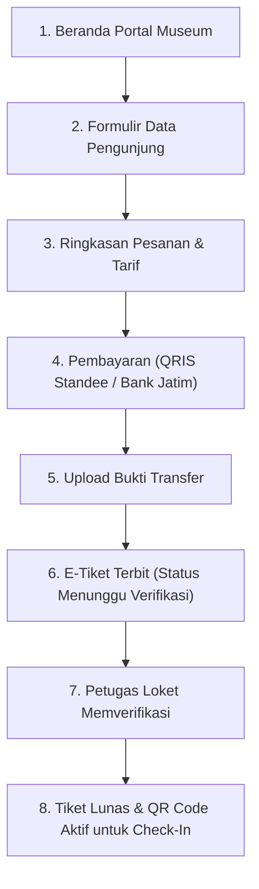
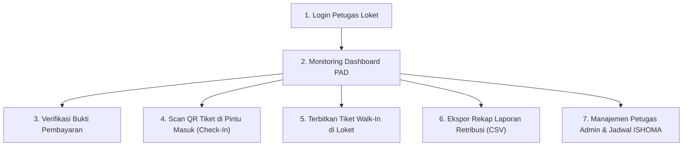

# 🏛️ Sistem E-Ticketing & Portal Budaya Museum Blambangan

Aplikasi web terpadu untuk pemesanan tiket kunjungan online, validasi gerbang digital (*QR code gate check-in*), pembayaran resmi kas daerah (*QRIS Standar Nasional & Bank Jatim*), manajemen operasional loket fisik (*Walk-In POS*), serta tata kelola akun petugas **Museum Blambangan Banyuwangi** di bawah naungan **Dinas Kebudayaan dan Pariwisata (DISBUDPAR) Kabupaten Banyuwangi**.

---

## 📋 Daftar Isi
1. [Ringkasan Proyek](#-ringkasan-proyek)
2. [Fitur Unggulan Terbaru](#-fitur-unggulan-terbaru)
3. [Tech Stack & Arsitektur](#-tech-stack--arsitektur)
4. [Rekening Resmi & Pembayaran Kas Daerah](#-rekening-resmi--pembayaran-kas-daerah)
5. [Alur Sistem Lengkap (End-to-End Flow)](#-alur-sistem-lengkap-end-to-end-flow)
   - [A. Alur Pengunjung (User / Public Flow)](#a-alur-pengunjung-user--public-flow)
   - [B. Alur Petugas Loket & Verifikasi (Admin Flow)](#b-alur-petugas-loket--verifikasi-admin-flow)
6. [Akun & Hak Akses Administrator](#-akun--hak-akses-administrator)
7. [Panduan Pengujian di Perangkat Mobile (HP)](#-panduan-pengujian-di-perangkat-mobile-hp)
8. [Struktur Direktori Proyek](#-struktur-direktori-proyek)
9. [Panduan Instalasi & Menjalankan](#-panduan-instalasi--menjalankan)
10. [Legalitas & Lembaga Pengelola](#-legalitas--lembaga-pengelola)

---

## 🌟 Ringkasan Proyek

Sistem ini mentransformasi layanan loket konvensional Museum Blambangan menjadi ekosistem digital terpadu yang modern, transparan, dan kental dengan nuansa budaya Banyuwangi:
* **Pengunjung Publik**: Memesan tiket dari mana saja, memilih sesi kunjungan dengan kuota langsung (*real-time capacity*), membayar lewat QRIS Nasional atau Bank Jatim, melacak riwayat di Profil Pengunjung, dan menerima E-Tiket ber-QR Code untuk dipindai di pintu masuk.
* **Petugas Loket & Verifikator**: Mengelola antrean verifikasi bukti transfer, memindai QR code tiket di pintu masuk, menerbitkan tiket langsung (*walk-in POS*), memantau tren pendapatan PAD, mengelola akun administrator, serta mengatur jadwal sesi & jam ISHOMA.

---

## 🚀 Fitur Unggulan Terbaru

### 1. 🎟️ E-Tiket Presisi A4 Anti-Hancur (*Isolated Print Engine*)
- Sistem cetak tiket menggunakan teknik **Isolated Iframe Printing** (`handleDirectPrint`).
- Menjamin hasil cetak print maupun simpan ke PDF berukuran tepat **1 lembar kertas A4** tanpa halaman pertama kosong dan tanpa kebocoran elemen navigasi web.
- Barcode 1D dan QR Code 2D tetap tajam dalam resolusi tinggi.

### 2. 💳 Standee QRIS Standar Nasional ASPI / Bank Indonesia
- Mengikuti standee pembayaran nasional Bank Indonesia dengan pita merah *QRIS Pembayaran Nasional*.
- Terdaftar resmi: **MUSEUM BLAMBANGAN**, **NMID: ID2024326864723**, **Terminal: A01**.
- Generator QR Canvas beresolusi tinggi dengan watermark logo museum di bagian tengah.
- Tombol salin nominal total bayar 1-klik dan indikator kompatibilitas semua e-wallet & mobile banking (BCA, Mandiri, BRI, BNI, Bank Jatim, GoPay, OVO, DANA, ShopeePay).

### 3. 💃 Ornamen & Formasi Gandrung Sewu di Sidebar
- Menghadirkan siluet formasi multi-penari **Gandrung Sewu Banyuwangi** berlapis (*foreground, center lead dancer, background*) dengan balutan warna emas (*Heritage Gold*).
- Ditempatkan secara proporsional di Sidebar Desktop dan Drawer Mobile tanpa mengganggu keterbacaan teks menu.
- Menggantikan penari tunggal pada *hero banner* agar foto arsip sejarah museum terlihat lebih bersih dan lega.

### 4. 👤 Profil Pengunjung Interaktif (*Visitor Hub*)
- **Kartu Identitas Pengunjung:** Avatar inisial berbingkai emas, lencana *"Sahabat Budaya"*, nama pemesan, dan alamat asal.
- **Ringkasan Statistik Cepat:** Counter total tiket aktif, total wisatawan dalam rombongan, dan status tiket terkini.
- **Riwayat E-Tiket Tersimpan:** Daftar seluruh tiket yang pernah dipesan di gawai tersebut, lengkap dengan tombol langsung *"Buka E-Tiket & QR Code"*.
- **Hubungkan Tiket Lain:** Form cepat untuk mengklaim kode booking dari perangkat lain agar tersimpan di gawai saat ini.

### 5. 👥 Manajemen Akun Petugas & Hak Akses Admin
- Pengelolaan akun admin dinamis dan tersimpan persisten (*localStorage*).
- **Tambah Admin Baru:** Form modal pendaftaran nama, email, username, password, peran, NIP, no. telepon, dan status.
- **Ubah / Edit Admin:** Mengubah profil petugas, mengganti peran atau mengatur ulang password.
- **Pembagian Peran (Role):**
  - *Superadmin:* Hak akses penuh seluruh sistem dan manajemen admin.
  - *Verifikator:* Verifikasi bukti transfer dan penerbitan tiket.
  - *Petugas Loket:* Pelayanan tiket langsung (*walk-in*) dan check-in gate.
  - *Keuangan:* Pemantauan laporan retribusi kas daerah.
- **Toggle Status & Proteksi:** Pengaktifan/penonaktifan akun dengan 1 klik switch, serta proteksi keamanan agar minimal 1 Superadmin utama tidak terhapus.

### 6. 🗺️ Google Maps Interaktif Resmi di Footer
- Peta lokasi langsung Museum Blambangan terintegrasi di bagian bawah portal.
- Dilengkapi tombol langsung *"Buka Petunjuk Arah di Google Maps ↗"* dan tombol *"Salin Alamat"* dengan notifikasi interaktif.

---

## 💻 Tech Stack & Arsitektur

| Kategori | Teknologi | Deskripsi Implementasi |
| :--- | :--- | :--- |
| **Core Framework** | **React 19** + **TypeScript** | Arsitektur komponen modular berbasis *Strict Mode* tanpa error runtime tipe data. |
| **Build Tool** | **Vite 8** | HMR (*Hot Module Replacement*) instan dan proses kompilasi produksi super cepat. |
| **Styling & Theme** | **Tailwind CSS** + **PostCSS** | Desain bertema *Royal Metallic Blue* (`#081827`) & *Banyuwangi Heritage Gold* (`#D4A359`). |
| **Layout Stability** | `scrollbar-gutter: stable` | Mencegah pergeseran tata letak horizontal saat bilah gulir muncul/hilang. |
| **State Management** | **React Context API** | Pengelolaan state terpusat via `BookingContext` tersinkronisasi dua arah dengan `localStorage`. |
| **QR Code Engine** | **`qrcode.react`** | Rendering QR Code berbasis SVG dan Canvas 2D untuk barcode tiket dan pembayaran QRIS. |
| **Dokumen & Cetak** | **Isolated Iframe Printing** | Pencetakan langsung dokumen tiket murni ke kertas A4 tanpa gangguan DOM luar. |
| **Ikonografi** | **`lucide-react`** + **Custom SVG** | Ikon vektor presisi dan ornamen motif Batik Gajah Oling simetris. |
| **Animasi** | **`canvas-confetti`** | Efek selebrasi konfeti interaktif saat verifikasi berhasil. |

---

## 💳 Rekening Resmi & Pembayaran Kas Daerah

Seluruh transaksi pembayaran e-tiket masuk langsung ke rekening kas resmi Pendapatan Asli Daerah (PAD) Pemerintah Kabupaten Banyuwangi:

* **Bank Penampung**: **Bank Jatim** *(PT Bank Pembangunan Daerah Jawa Timur • Kode Bank: 114)*
* **Nomor Rekening**: **`0021005380`**
* **Atas Nama Rekening**: **`DISBUDPAR KAB BANYUWANGI`**
* **Metode QRIS**: **QRIS Standar Nasional Bank Indonesia**
  * **Nama Merchant**: `MUSEUM BLAMBANGAN`
  * **NMID**: `ID2024326864723`
  * **Terminal**: `A01`

---

## 🔄 Alur Sistem Lengkap (End-to-End Flow)

### A. Alur Pengunjung (User / Public Flow)



1. **Akses Portal & Eksplorasi:** Pengunjung melihat koleksi artefak, jadwal buka loket, dan peta lokasi Google Maps.
2. **Formulir Pemesanan:** Mengisi identitas pemesan, jumlah wisatawan, memilih kategori tiket, tanggal, dan sesi kunjungan.
   - *Pelajar / Mahasiswa:* Rp 5.000 / orang
   - *Pengunjung Umum:* Rp 7.500 / orang
   - *Wisatawan Mancanegara:* Rp 20.000 / orang
   - *Pelajar Rombongan:* Rp 5.000 / orang
3. **Pembayaran Kas Daerah:** Memindai QRIS Standee resmi atau transfer langsung ke rekening Bank Jatim.
4. **Unggah Bukti Bayar:** Melampirkan foto struk transfer untuk diverifikasi petugas.
5. **E-Tiket & Profil:** Menerima Kode Booking unik (contoh: `MB-20261006-4837`). Tiket otomatis tersimpan di Profil Pengunjung dan dapat diunduh/dicetak.

---

### B. Alur Petugas Loket & Verifikasi (Admin Flow)



1. **Dashboard PAD:** Memantau akumulasi retribusi kas daerah harian, mingguan, dan bulanan secara *real-time*.
2. **Verifikasi Pesanan:** Memeriksa keabsahan bukti bayar pengunjung dan menyetujui penerbitan tiket resmi.
3. **Gate Scanner Check-In:** Memindai QR Code tiket pengunjung di gerbang masuk via kamera HP atau webcam laptop.
4. **Tiket Walk-In POS:** Melayani pengunjung rombongan langsung di meja loket secara instan.
5. **Manajemen Admin:** Menambah atau mengubah akun petugas loket, verifikator, dan admin keuangan.

---

## 🔐 Akun & Hak Akses Administrator

Akun bawaan sistem untuk kebutuhan pengujian dan operasional:

| Role / Jabatan | Nama Petugas | Email / NIP | Kata Sandi | Hak Akses Utama |
| :--- | :--- | :--- | :--- | :--- |
| **Superadmin** | Budi Prasetyo, S.Sos | `admin@museumblambangan.id` | `admin123` | Akses penuh seluruh sistem & manajemen admin |
| **Verifikator** | Siti Aminah, S.Pd | `petugas@museumblambangan.id` | `admin123` | Verifikasi struk, persetujuan & tolak bukti bayar |
| **Keuangan** | Dian Kusuma Wardani, S.E | `keuangan@museumblambangan.id` | `admin123` | Rekap laporan keuangan & ekspor data retribusi PAD |
| **Petugas Loket** | Eko Wahyudi | `198501152010011002` | `admin123` | Layanan tiket walk-in & check-in gate scanner |

---

## 📱 Panduan Pengujian di Perangkat Mobile (HP)

Aplikasi dirancang **100% responsif** dan dapat diuji langsung melalui smartphone:

1. **Hubungkan HP ke Jaringan yang Sama:** Pastikan HP dan Laptop terhubung ke Wi-Fi / Hotspot yang sama.
2. **Jalankan Server dengan Parameter Host:**
   ```bash
   npm run dev -- --host
   ```
3. **Buka Browser di HP (Chrome / Safari):**
   Ketik alamat IP laptop Anda yang tertera di terminal, contoh:
   ```text
   http://10.101.209.43:5173/
   ```
4. **Halaman yang Siap Diuji di HP:**
   - **Portal Pengunjung:** `http://10.101.209.43:5173/`
   - **Formulir Booking:** `http://10.101.209.43:5173/#user/form`
   - **Tiket Saya:** `http://10.101.209.43:5173/#user/tiket`
   - **Login Admin:** `http://10.101.209.43:5173/#login`
   - **Gate Scanner Kamera HP:** `http://10.101.209.43:5173/#admin/scan`

---

## 📁 Struktur Direktori Proyek

```text
PROJECT MAGANG/
├── public/
│   ├── assets/
│   │   ├── logo-museum-blambangan-resmi.png # Logo resmi Museum Blambangan
│   │   ├── penari-gandrung-gold.png         # Aset siluet emas penari Gandrung
│   │   ├── gajah-oling-footer-symmetric.png # Ornamen simetris Batik Gajah Oling
│   │   ├── qris-museum-blambangan.jpg       # QRIS resmi Bank Jatim
│   │   ├── slide-1-gedung-museum-hd.jpg     # Foto HD fasad gedung museum
│   │   ├── slide-2-candi-macan-putih-hd.jpg # Foto HD artefak Candi Macan Putih
│   │   ├── slide-3-galeri-sejarah-hd.jpg    # Foto HD galeri arsip sejarah
│   │   └── slide-4-lingga-yoni-hd.jpg       # Foto HD peninggalan arca klasik
│   └── favicon.ico
├── src/
│   ├── components/
│   │   ├── admin/                           # Panel Petugas & Loket Kasir
│   │   │   ├── AdminDashboard.tsx           # Dashboard statistik retribusi & grafik
│   │   │   ├── AdminLayout.tsx              # Shell admin dengan sidebar dinamis
│   │   │   ├── AdminLogin.tsx               # Halaman login petugas loket
│   │   │   ├── AdminPesananKunjungan.tsx    # Tabel pemesanan & filter status
│   │   │   ├── AdminDetailPesanan.tsx       # Modal telaah & verifikasi bukti transfer
│   │   │   ├── AdminScanValidasi.tsx        # Gate check-in kamera scanner QR
│   │   │   ├── AdminDataPengunjung.tsx      # Basis data & arsip wisatawan
│   │   │   ├── AdminWalkInModal.tsx         # Tiket on-the-spot di meja loket
│   │   │   ├── AdminLaporan.tsx             # Rekap laporan retribusi & ekspor CSV
│   │   │   ├── AdminNotifikasiRiwayat.tsx   # Pusat notifikasi pesanan masuk
│   │   │   └── AdminPengaturan.tsx          # Pengaturan sesi, ISHOMA & Manajemen Admin
│   │   ├── common/                          # Komponen Budaya & Utilitas Bersama
│   │   │   ├── GandrungSewuSidebarFormation.tsx # Formasi siluet Gandrung Sewu di sidebar
│   │   │   ├── ModernTicketPass.tsx         # E-Tiket ber-Barcode, QR & isolated print
│   │   │   ├── MuseumFeatureModals.tsx      # Modal Koleksi, Info, Kontak & Profil Pengunjung
│   │   │   ├── SocialMediaLinks.tsx         # Ikon media sosial resmi simetris
│   │   │   ├── GajahOlingMotif.tsx          # Vektor ornamen Batik Gajah Oling
│   │   │   ├── MuseumLogo.tsx               # Komponen logo resmi museum
│   │   │   ├── VideoPitching.tsx            # Pemutar video pitching interaktif
│   │   │   └── SiluetPenariGandrung.tsx     # Komponen siluet SVG penari Gandrung
│   │   └── user/                            # Modul Publik & Wisatawan
│   │       ├── LandingPage.tsx              # Layar beranda mobile
│   │       ├── FormBooking.tsx              # Formulir reservasi data pengunjung
│   │       ├── RingkasanBooking.tsx         # Rincian ringkasan biaya tiket
│   │       ├── PembayaranQRIS.tsx           # Standee QRIS Nasional & transfer Bank Jatim
│   │       ├── BookingBerhasil.tsx          # Halaman konfirmasi booking berhasil
│   │       ├── StatusTiket.tsx              # Pelacakan status verifikasi pembayaran
│   │       ├── TiketKunjungan.tsx           # Tampilan e-tiket aktif pengunjung
│   │       ├── SimulatorMobile.tsx          # Pratinjau tampilan aplikasi mobile
│   │       ├── UserMusewangiDashboard.tsx   # Panduan cerdas & katalog cagar budaya
│   │       └── UserWebPortal.tsx            # Portal utama publik (desktop & mobile drawer)
│   ├── context/
│   │   └── BookingContext.tsx               # State global transaksi & manajemen admin
│   ├── types/
│   │   └── index.ts                         # Definisi tipe data Booking, AdminUser, dsb
│   ├── utils/
│   │   ├── qrisDownloadUtils.ts             # Generator gambar QRIS kanvas resolusi tinggi
│   │   └── sessionUtils.ts                  # Logika sesi harian, kuota & waktu ISHOMA
│   ├── App.tsx                              # Router utama aplikasi
│   ├── index.css                            # Konfigurasi Tailwind & print CSS
│   └── main.tsx                             # Entry point React
├── package.json
└── vite.config.ts
```

---

## 🚀 Panduan Instalasi & Menjalankan

### 1. Prasyarat Sistem
* **Node.js**: Versi `18.x` atau lebih baru
* **NPM**: Versi `9.x` atau lebih baru

### 2. Langkah Instalasi
Buka terminal pada direktori proyek:
```bash
# 1. Masuk ke folder proyek
cd "d:\PROJECT MAGANG"

# 2. Pasang dependensi
npm install
```

### 3. Menjalankan Server Pengembangan (Lokal & Jaringan HP)
```bash
npm run dev -- --host
```
Akses di browser:
* **Komputer Lokal:** `http://localhost:5173/`
* **Smartphone (Jaringan Wi-Fi):** `http://<IP-Laptop>:5173/`

### 4. Membangun Versi Produksi (*Production Build*)
```bash
npm run build
```
Hasil berkas produksi teroptimasi akan berada di folder `dist/` dan siap dideploy ke server web (Vercel, Netlify, Nginx, Apache, dsb).

### 5. Menguji Hasil Build Secara Lokal (*Production Preview*)
```bash
npm run preview
```
Akses di browser untuk memastikan berkas hasil kompilasi produksi berjalan 100% mulus sebelum upload.

---

## 🌐 Panduan Deployment ke Hosting / Server (Produksi)

### Opsi A: Deploy ke Vercel (Paling Direkomendasikan & Cepat)
Proyek ini telah dilengkapi berkas konfigurasi `vercel.json` bawaan:
1. Hubungkan repository GitHub proyek ke akun [Vercel](https://vercel.com).
2. Pilih framework **Vite**.
3. *Build Command:* `npm run build`
4. *Output Directory:* `dist`
5. Klik **Deploy**. Proyek otomatis aktif dengan HTTPS gratis dan performa CDN global super cepat.

### Opsi B: Deploy ke Netlify
Proyek ini telah dilengkapi berkas `public/_redirects` bawaan untuk mengatasi *SPA Client-Side Routing*:
1. Tarik / unggah folder `dist` langsung ke dashboard [Netlify Drop](https://app.netlify.com/drop).
2. Atau hubungkan repository GitHub dengan pengaturan:
   - *Build command:* `npm run build`
   - *Publish directory:* `dist`

### Opsi C: Deploy ke VPS / Server Sendiri (Nginx)
Jika dideploy pada VPS Pemerintah Kabupaten Banyuwangi menggunakan Nginx:
```nginx
server {
    listen 80;
    server_name tiket.museumblambangan.id;
    root /var/www/project-magang/dist;
    index index.html;

    location / {
        try_files $uri $uri/ /index.html;
    }

    # Cache file statis (gambar, font, css, js)
    location ~* \.(jpg|jpeg|png|gif|svg|ico|css|js|woff|woff2)$ {
        expires 30d;
        add_header Cache-Control "public, no-transform";
    }
}
```

---

## 🏛️ Legalitas & Lembaga Pengelola

* **Instansi**: Dinas Kebudayaan dan Pariwisata (DISBUDPAR) Kabupaten Banyuwangi
* **Unit Pelaksana Teknis**: Museum Blambangan Banyuwangi
* **Alamat Resmi**: Jl. Jenderal Ahmad Yani No. 78, Taman Baru, Kec. Banyuwangi, Kabupaten Banyuwangi, Jawa Timur 68416
* **Layanan Informasi**: +62 852-8725-8502
* **Tagline**: *Banyuwangi Rebound • The Sunrise of Java*
